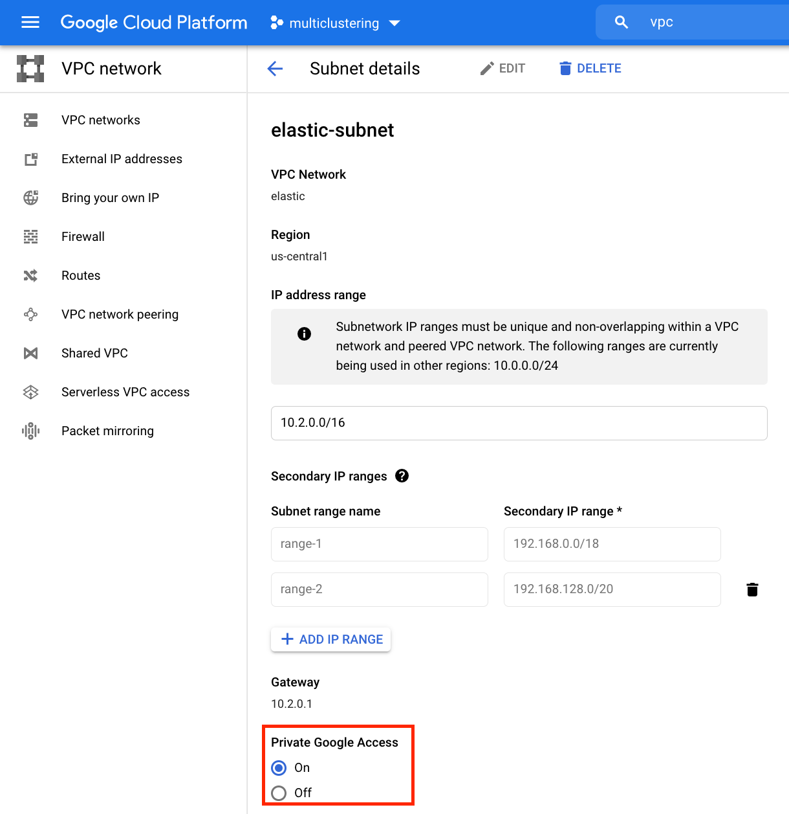
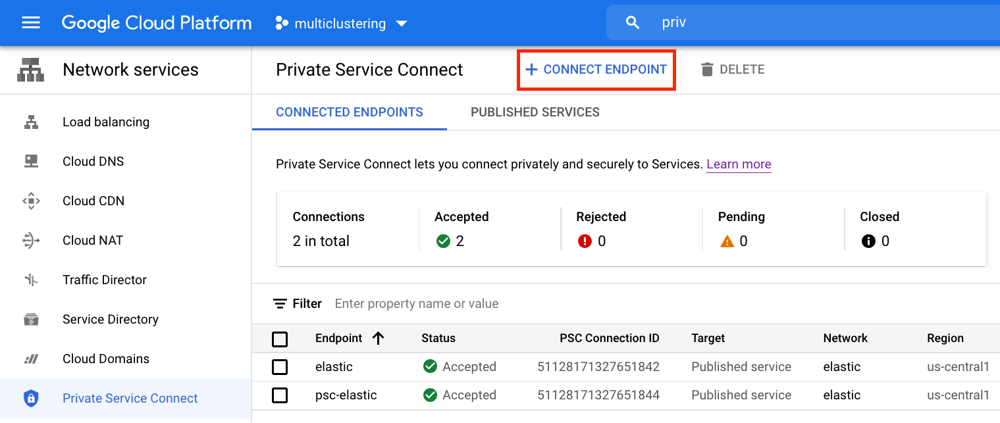
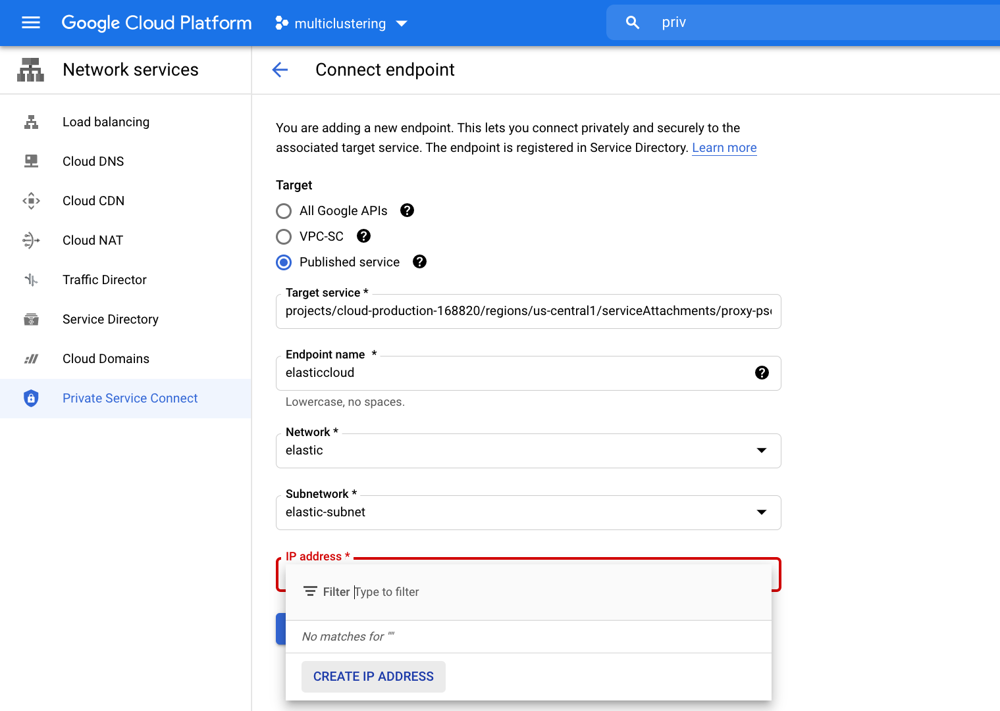
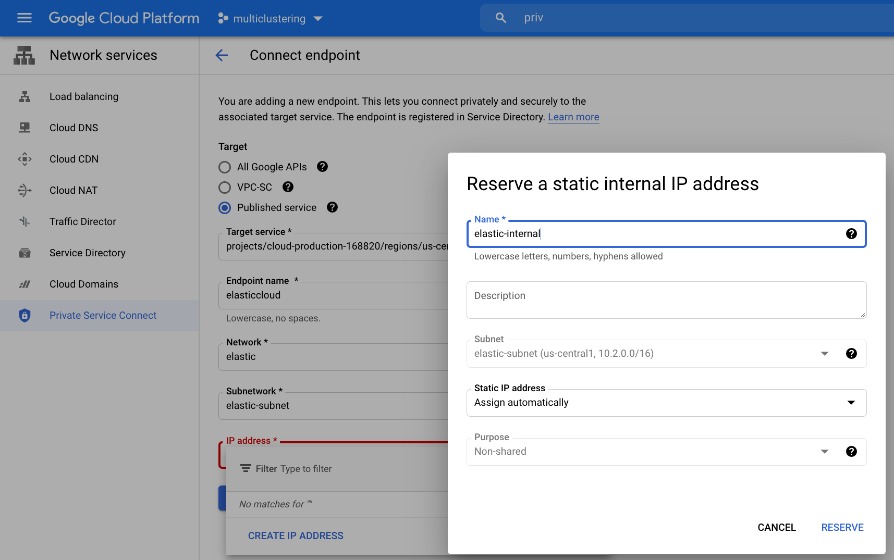
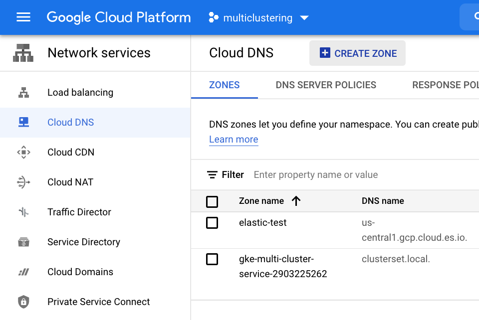
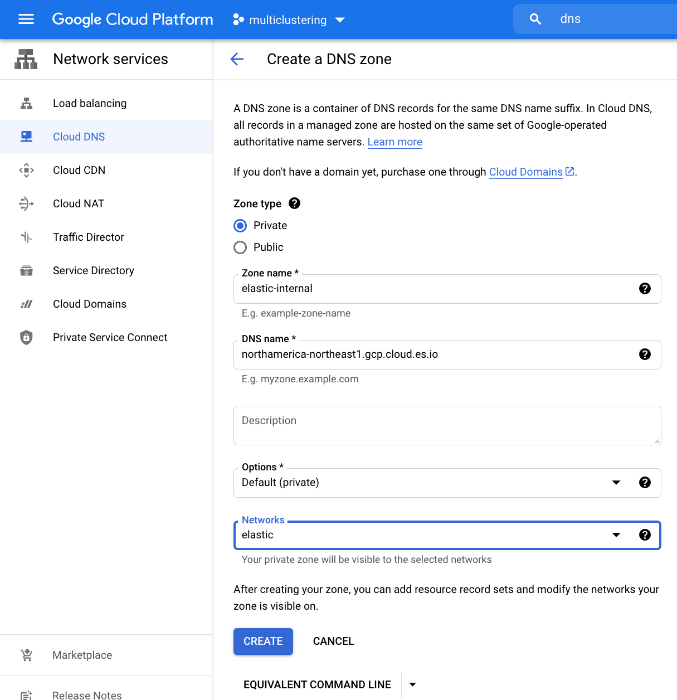
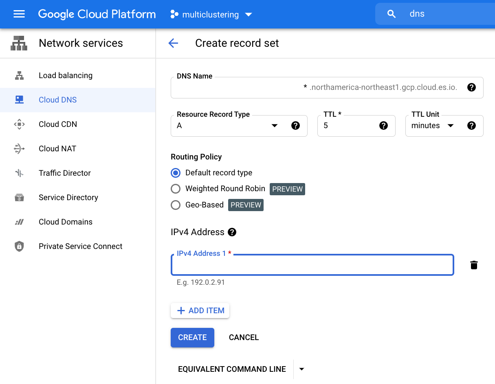
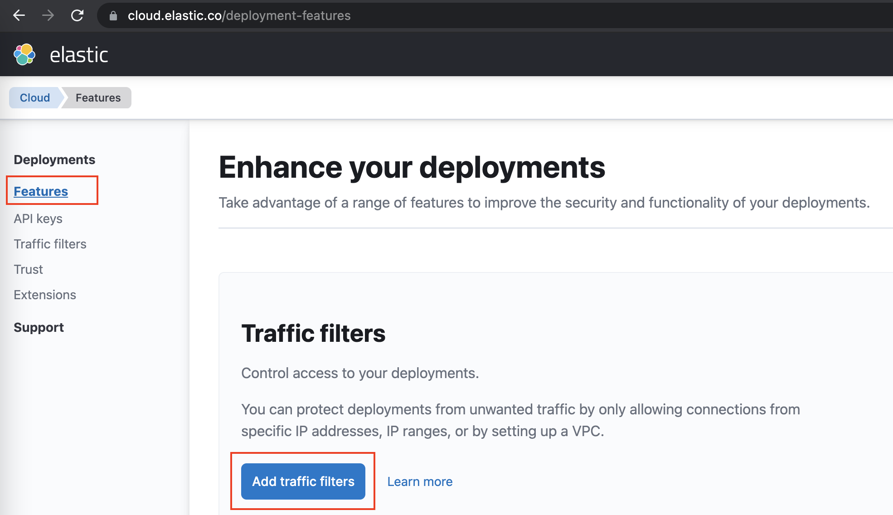
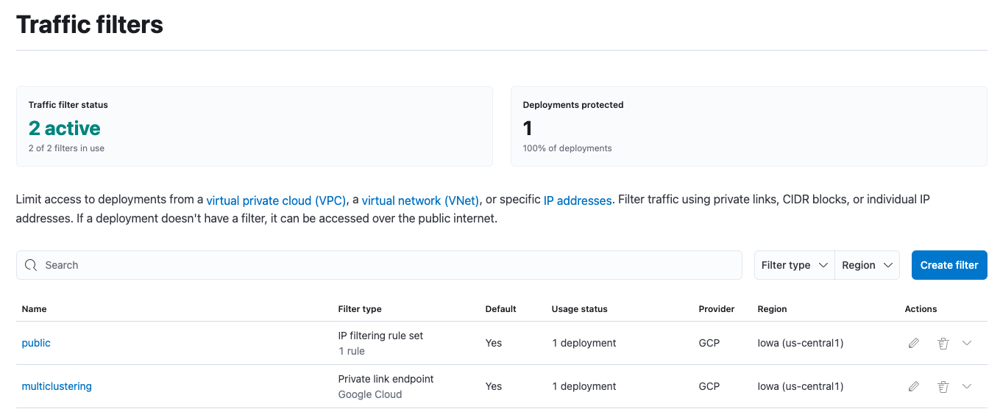
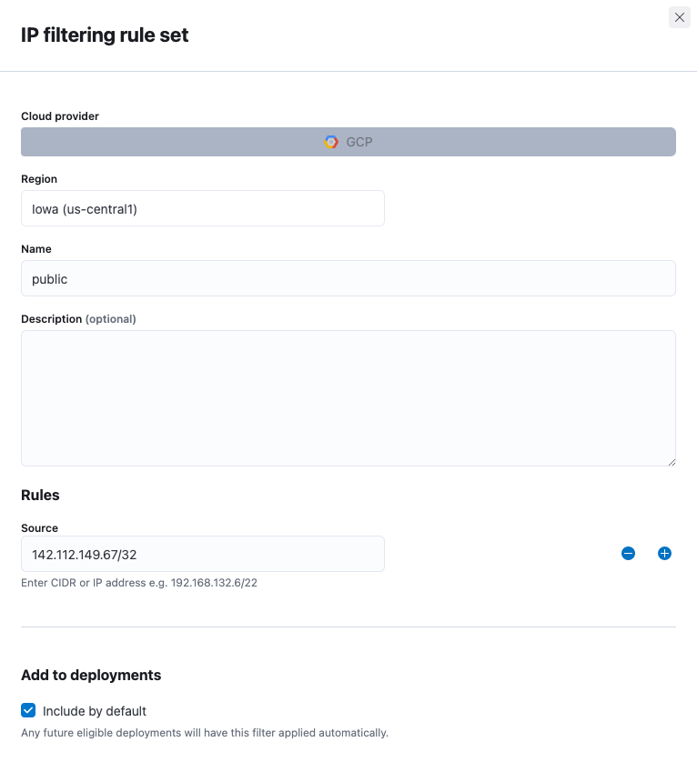

# Use Google Cloud Private Security Connect to Elastic Cloud

## Set up Google Cloud Private Security Connect 

Enable required Google Cloud APIs by going [here](https://console.cloud.google.com/apis?_ga=2.159415101.1031624660.1634564800-178738502.1633367702).

Search for `Compute Engine API`, `Service Directory API`, `Cloud DNS API` and enable those. 

In your existing VPC network where your GKE clusters are running in, turn on `Private Google Access`

Go to `Network Services` > `Private Service Connect`, create a new connect endpoint:

Configure the endpoint:

* Target: Published service 
* Target service: `projects/cloud-production-168820/regions/us-central1/serviceAttachments/proxy-psc-production-us-central1-v1-attachment`
* Endpoint name: elasticcloud. Please follow your naming convention.
* Network: Use the same network as your GKE clusters
* Subnetwork: Use the subnet you configured `Private Google Access` previously.
* IP address: Click on CREATE IP ADDRESS to create a new one in place.

Create an IP address:

Add the endpoint. 

A connect endpoint is created. Note down the `PCS Connection ID` and `IP Address`

## Set up private DNS records

***Note: This will impact your routing to any URLs containing `northamerica-northeast1.gcp.cloud.es.io`. Please confirm before making the changes.***

In order to avoid any configuration changes to your filebeat, create a DNS record so that Elastic endpoints will resolve to the private IP address configured before. 

Create a private DNS zone: 

Configure the DNS zone:

Configure the zone as follows:

* Zone type: private
* Zone name: elastic. Please follow your naming convention.
* DNS name: northamerica-northeast1.gcp.cloud.es.io 
* Networks: Select the same network as your GKE clusters

Create a DNS A record:

* DNS name: *.northamerica-northeast1.gcp.cloud.es.io 
* IPv4 Address: the value of the static internal IP from the previous step.

# Configure Elastic Cloud Traffic Filtering
Traffic filtering is one of the security capabilities in Elastic Cloud that allows you to restrict inbound traffic to only the sources that you trust. Private Service Connect filtering is one traffic filtering option available for Elastic Cloud deployments in Google Cloud.

From Elastic Cloud UI, navigate to Features and click the Add traffic filters button.

Create a filter for GCP deployment. Set regoin and PSC ID you got from first step. Click on `Include by Default` to automatically use PSC for any existing or new Elastic deployments. 

Add a public traffic filter to allow users to access Kibana:

## Reference
[Getting Started with Google Private Service Connect in Elastic Cloud](https://www.linkedin.com/pulse/getting-started-google-private-service-connect-elastic-adam-quan/?trk=articles_directory)
